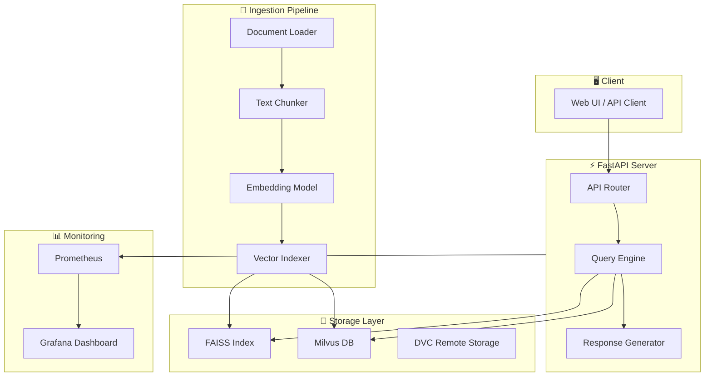
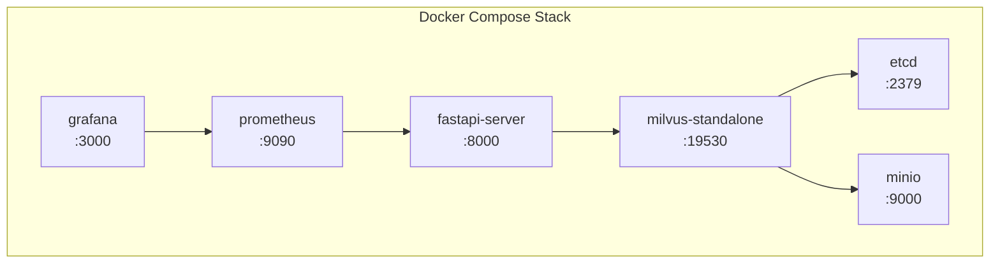

# Architecture

> visionRAG의 RAG 파이프라인 아키텍처, 컴포넌트 구성, Docker Compose 환경

## RAG 파이프라인 개요

visionRAG는 멀티모달 데이터(텍스트 + 이미지)를 처리하는 6단계 RAG 파이프라인을 구현합니다.

### 단계별 상세

| 단계 | 설명 | 주요 모듈 |
|------|------|-----------|
| **Ingest** | PDF, 이미지, 텍스트 파일을 수집하여 원시 데이터로 변환 | `src/ingestion/loader.py` |
| **Chunk** | 문서를 의미 단위로 분할 (텍스트 청킹, 이미지 캡셔닝) | `src/ingestion/chunker.py` |
| **Embed** | 멀티모달 임베딩 모델로 벡터 변환 | `src/ingestion/embedder.py` |
| **Index** | FAISS 또는 Milvus에 벡터 인덱싱 | `src/ingestion/indexer.py` |
| **Query** | 사용자 질의를 벡터로 변환 후 유사 문서 검색 | `src/api/query.py` |
| **Generate** | 검색된 컨텍스트를 LLM에 전달하여 답변 생성 | `src/api/generate.py` |

## 컴포넌트 다이어그램

## Docker Compose 구성

visionRAG는 Docker Compose로 전체 스택을 관리합니다.

### 서비스 목록

| 서비스 | 포트 | 설명 |
|--------|------|------|
| `fastapi-server` | 8000 | RAG API 서버 |
| `milvus-standalone` | 19530 | 벡터 데이터베이스 |
| `etcd` | 2379 | Milvus 메타데이터 저장소 |
| `minio` | 9000 | Milvus 오브젝트 스토리지 |
| `prometheus` | 9090 | 메트릭 수집 서버 |
| `grafana` | 3000 | 모니터링 대시보드 |

## 데이터 흐름

1. **Ingestion Phase**: 원시 데이터 → 전처리 → 청킹 → 임베딩 → 인덱싱
2. **Query Phase**: 사용자 질의 → 질의 임베딩 → 벡터 검색 → 컨텍스트 조합 → LLM 생성
3. **Feedback Loop**: 응답 평가 → 메트릭 수집 → 파이프라인 최적화

## 설계 원칙

- **모듈성**: 각 파이프라인 단계가 독립적으로 교체 가능
- **확장성**: Milvus를 통한 분산 벡터 검색 지원
- **재현성**: DVC를 통한 데이터 및 실험 버전 관리
- **관측성**: Prometheus/Grafana를 통한 전체 파이프라인 모니터링