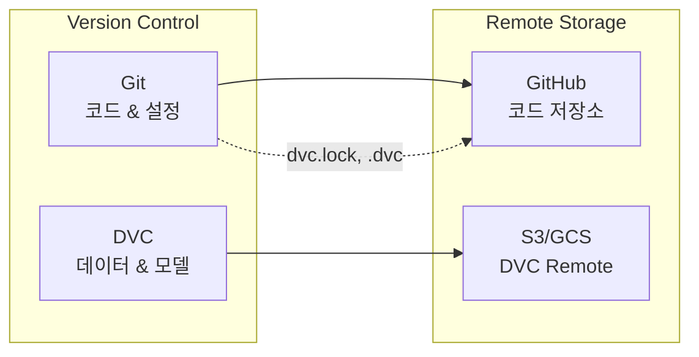
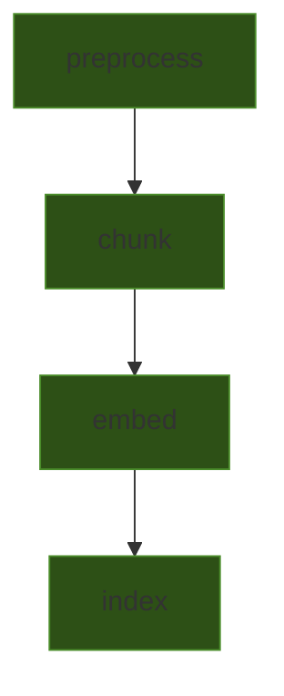

# Data Pipeline

> DVC 기반 데이터 버전 관리, 파이프라인 정의, 데이터 폴더 구조

## 개요

visionRAG는 **DVC (Data Version Control)**를 사용하여 데이터셋, 모델 가중치, 실험 결과를 버전 관리합니다. Git으로 코드를, DVC로 데이터를 추적하여 완전한 재현성을 보장합니다.



## DVC 데이터 관리

### DVC 초기 설정

```bash
# DVC 초기화 (이미 완료됨)
dvc init

# 리모트 스토리지 설정
dvc remote add -d storage s3://visionrag-data/dvc-store
dvc remote modify storage region us-east-1
```

### 데이터 추적

```bash
# 대용량 데이터 파일/디렉토리 추적
dvc add data/raw/documents/
dvc add data/raw/images/
dvc add models/embeddings/

# Git에 .dvc 파일 커밋
git add data/raw/documents.dvc data/raw/images.dvc models/embeddings.dvc
git commit -m "chore: track data with DVC"

# 리모트에 데이터 푸시
dvc push
```

### 데이터 가져오기

```bash
# 리모트에서 데이터 풀
dvc pull

# 특정 파일만 풀
dvc pull data/raw/documents.dvc
```

## dvc.yaml 파이프라인

`dvc.yaml`은 데이터 처리 파이프라인의 각 단계를 선언적으로 정의합니다.

```yaml
stages:
  preprocess:
    cmd: python -m src.ingestion.preprocess --input data/raw --output data/processed
    deps:
      - src/ingestion/preprocess.py
      - data/raw/
    outs:
      - data/processed/

  chunk:
    cmd: python -m src.ingestion.chunker --input data/processed --output data/chunks
    deps:
      - src/ingestion/chunker.py
      - data/processed/
    params:
      - chunk_size
      - chunk_overlap
    outs:
      - data/chunks/

  embed:
    cmd: python -m src.ingestion.embedder --input data/chunks --output data/embeddings
    deps:
      - src/ingestion/embedder.py
      - data/chunks/
    params:
      - embedding_model
    outs:
      - data/embeddings/

  index:
    cmd: python -m src.ingestion.indexer --input data/embeddings --output data/index
    deps:
      - src/ingestion/indexer.py
      - data/embeddings/
    outs:
      - data/index/
```

### 파이프라인 실행

```bash
# 전체 파이프라인 실행 (변경된 단계만 재실행)
dvc repro

# 특정 단계부터 실행
dvc repro embed

# 파이프라인 DAG 시각화
dvc dag
```

### 파이프라인 DAG



## 데이터 폴더 구조

```
data/
├── raw/                    # 원시 데이터 (DVC 추적)
│   ├── documents/          # PDF, TXT 등 텍스트 문서
│   ├── images/             # 이미지 파일
│   └── metadata.json       # 데이터 소스 메타데이터
├── processed/              # 전처리된 데이터 (DVC 추적)
│   ├── text/               # 추출된 텍스트
│   └── captions/           # 이미지 캡션
├── chunks/                 # 청킹된 데이터 (DVC 추적)
│   └── chunks.jsonl        # 청크 단위 JSONL
├── embeddings/             # 벡터 임베딩 (DVC 추적)
│   └── embeddings.npy      # NumPy 배열
├── index/                  # 벡터 인덱스 (DVC 추적)
│   ├── faiss.index         # FAISS 인덱스 파일
│   └── metadata.json       # 인덱스 메타데이터
└── eval/                   # 평가 데이터셋
    └── qa_pairs.json       # 질의-답변 쌍
```

## 파라미터 관리

`params.yaml`에서 파이프라인 파라미터를 중앙 관리합니다:

```yaml
# params.yaml
chunk_size: 512
chunk_overlap: 50
embedding_model: "clip-ViT-B-32"
vector_db: "faiss"
top_k: 5
score_threshold: 0.7
```

## 실험 추적

```bash
# 실험 실행
dvc exp run --set-param chunk_size=256

# 실험 결과 비교
dvc exp show
dvc exp diff

# 최적 실험 적용
dvc exp apply exp-abc123
```