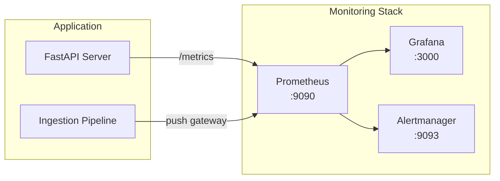

# Monitoring

> Prometheus/Grafana 기반 모니터링 대시보드, 메트릭 설명, 알림 설정

## 모니터링 아키텍처



## Prometheus 설정

### 메트릭 수집 구성

`prometheus.yml` 설정 예시:

```yaml
global:
  scrape_interval: 15s
  evaluation_interval: 15s

scrape_configs:
  - job_name: 'fastapi'
    static_configs:
      - targets: ['fastapi-server:8000']
    metrics_path: '/metrics'

  - job_name: 'milvus'
    static_configs:
      - targets: ['milvus-standalone:9091']

  - job_name: 'node-exporter'
    static_configs:
      - targets: ['node-exporter:9100']
```

### 메트릭 엔드포인트

FastAPI 서버는 `/metrics` 엔드포인트를 통해 Prometheus 형식의 메트릭을 노출합니다:

```python
# src/api/metrics.py
from prometheus_client import Counter, Histogram, Gauge

# 요청 메트릭
REQUEST_COUNT = Counter(
    'rag_request_total',
    'Total RAG requests',
    ['method', 'endpoint', 'status']
)

QUERY_LATENCY = Histogram(
    'rag_query_duration_seconds',
    'Query processing duration',
    buckets=[0.1, 0.25, 0.5, 1.0, 2.5, 5.0, 10.0]
)

# 파이프라인 메트릭
RETRIEVAL_SCORE = Histogram(
    'rag_retrieval_score',
    'Top-k retrieval similarity scores',
    buckets=[0.5, 0.6, 0.7, 0.8, 0.9, 0.95, 1.0]
)

DOCUMENTS_INDEXED = Gauge(
    'rag_documents_indexed_total',
    'Total number of indexed documents'
)

VECTOR_STORE_SIZE = Gauge(
    'rag_vector_store_size_bytes',
    'Vector store size in bytes'
)
```

## 메트릭 설명

### API 메트릭

| 메트릭 이름 | 타입 | 설명 |
|------------|------|------|
| `rag_request_total` | Counter | 전체 API 요청 수 (메서드, 엔드포인트, 상태코드별) |
| `rag_query_duration_seconds` | Histogram | 질의 처리 소요 시간 분포 |
| `rag_active_requests` | Gauge | 현재 처리 중인 요청 수 |
| `rag_error_total` | Counter | 에러 발생 횟수 (타입별) |

### RAG 파이프라인 메트릭

| 메트릭 이름 | 타입 | 설명 |
|------------|------|------|
| `rag_retrieval_score` | Histogram | 검색된 문서의 유사도 점수 분포 |
| `rag_retrieval_count` | Histogram | 질의당 검색된 문서 수 |
| `rag_generation_tokens` | Histogram | 생성된 응답의 토큰 수 |
| `rag_documents_indexed_total` | Gauge | 인덱싱된 전체 문서 수 |
| `rag_vector_store_size_bytes` | Gauge | 벡터 스토어 크기 |

### 시스템 메트릭

| 메트릭 이름 | 타입 | 설명 |
|------------|------|------|
| `process_cpu_seconds_total` | Counter | CPU 사용 시간 |
| `process_resident_memory_bytes` | Gauge | 메모리 사용량 |
| `python_gc_collections_total` | Counter | GC 실행 횟수 |

## Grafana 대시보드

### 대시보드 구성

Grafana에 3개의 주요 대시보드가 사전 구성되어 있습니다:

#### 1. RAG Overview 대시보드

```
┌─────────────────────────────────────────────────────┐
│  RAG Overview                                        │
├──────────────┬──────────────┬───────────────────────┤
│ Total Queries│ Avg Latency  │ Error Rate             │
│    1,234     │   0.45s      │   0.2%                │
├──────────────┴──────────────┴───────────────────────┤
│ [Query Latency Over Time - Line Chart]               │
├─────────────────────────────────────────────────────┤
│ [Retrieval Score Distribution - Heatmap]             │
├─────────────────────────────────────────────────────┤
│ [Documents Indexed - Gauge]                          │
└─────────────────────────────────────────────────────┘
```

#### 2. System Health 대시보드
- CPU/메모리 사용량 추이
- Docker 컨테이너별 리소스 사용량
- 네트워크 I/O
- 디스크 사용량

#### 3. Milvus Metrics 대시보드
- 컬렉션별 벡터 수
- 검색 QPS
- 인덱싱 속도
- 메모리/디스크 사용량

### Grafana 접속

```
URL: http://localhost:3000
초기 계정: admin / admin (또는 .env에 설정한 비밀번호)
```

### 대시보드 프로비저닝

대시보드 JSON은 `monitoring/dashboards/` 디렉토리에 저장되어 Docker Compose 시작 시 자동 프로비저닝됩니다.

## 알림 규칙

### Prometheus Alert Rules

```yaml
# monitoring/alerts.yml
groups:
  - name: rag-alerts
    rules:
      - alert: HighQueryLatency
        expr: histogram_quantile(0.95, rag_query_duration_seconds_bucket) > 5
        for: 5m
        labels:
          severity: warning
        annotations:
          summary: "95th percentile query latency > 5s"

      - alert: HighErrorRate
        expr: rate(rag_error_total[5m]) / rate(rag_request_total[5m]) > 0.05
        for: 2m
        labels:
          severity: critical
        annotations:
          summary: "Error rate exceeds 5%"

      - alert: VectorStoreDown
        expr: up{job="milvus"} == 0
        for: 1m
        labels:
          severity: critical
        annotations:
          summary: "Milvus vector store is down"
```

## 유용한 PromQL 쿼리

| 목적 | PromQL |
|------|--------|
| 분당 요청 수 | `rate(rag_request_total[1m])` |
| 평균 응답 시간 | `rate(rag_query_duration_seconds_sum[5m]) / rate(rag_query_duration_seconds_count[5m])` |
| p95 응답 시간 | `histogram_quantile(0.95, rate(rag_query_duration_seconds_bucket[5m]))` |
| 에러율 | `rate(rag_error_total[5m]) / rate(rag_request_total[5m])` |
| 인덱싱된 문서 수 | `rag_documents_indexed_total` |