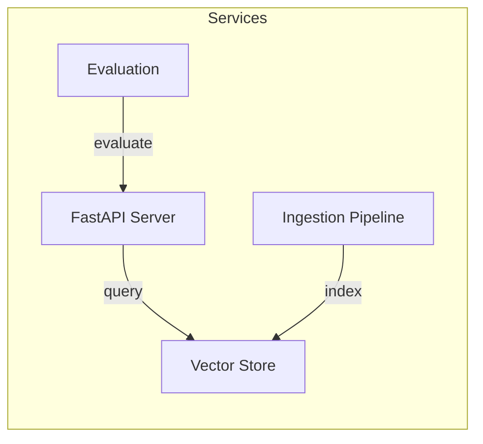

# Services

> visionRAG를 구성하는 주요 서비스 및 컴포넌트 설명

## 서비스 개요



## FastAPI 서버

### 개요
`src/api/` 디렉토리에 위치한 FastAPI 기반 REST API 서버입니다. 클라이언트의 질의를 받아 벡터 검색을 수행하고, LLM을 통해 답변을 생성하여 반환합니다.

### 주요 엔드포인트

| 엔드포인트 | 메서드 | 설명 |
|-----------|--------|------|
| `/api/query` | POST | 텍스트 질의를 받아 RAG 응답 반환 |
| `/api/upload` | POST | 새 문서 업로드 및 인덱싱 |
| `/api/health` | GET | 서버 및 의존 서비스 상태 확인 |
| `/api/collections` | GET | 벡터 컬렉션 목록 조회 |
| `/metrics` | GET | Prometheus 메트릭 노출 |

### 설정

```python
# src/config/settings.py
class Settings:
    API_HOST: str = "0.0.0.0"
    API_PORT: int = 8000
    VECTOR_DB_TYPE: str = "faiss"  # "faiss" or "milvus"
    MILVUS_HOST: str = "localhost"
    MILVUS_PORT: int = 19530
    EMBEDDING_MODEL: str = "clip-ViT-B-32"
    LLM_MODEL: str = "gpt-4-vision-preview"
```

### 실행

```bash
# 직접 실행
uvicorn src.api.main:app --host 0.0.0.0 --port 8000 --reload

# Docker를 통한 실행
docker compose up fastapi-server
```

## Ingestion Pipeline

### 개요
`src/ingestion/` 디렉토리에 위치한 데이터 수집 및 처리 파이프라인입니다. 다양한 형식의 문서를 읽어들여 벡터로 변환하고 인덱싱합니다.

### 파이프라인 단계

```mermaid
flowchart TD
    A[Document Loader] -->|원시 데이터| B[Preprocessor]
    B -->|정제된 데이터| C[Chunker]
    C -->|텍스트 청크| D[Embedder]
    D -->|벡터| E[Indexer]
    E -->|인덱스 저장| F[(Vector Store)]

    style A fill:#2d5016,stroke:#4a8c2a
    style F fill:#1e3a5f,stroke:#4a90d9
```



### 지원 파일 형식

| 형식 | 로더 | 비고 |
|------|------|------|
| PDF | `PyPDFLoader` | 텍스트 및 이미지 추출 |
| 이미지 | `ImageLoader` | JPEG, PNG, WebP |
| 텍스트 | `TextLoader` | TXT, MD, CSV |
| HTML | `HTMLLoader` | 웹 페이지 크롤링 결과 |

### 실행 방법

```bash
# 전체 파이프라인 실행
python -m src.ingestion.run --input-dir ./data/raw --output-dir ./data/processed

# 특정 단계만 실행
python -m src.ingestion.run --step embed --input-dir ./data/chunks
```

## Vector Store

### 개요
벡터 임베딩을 저장하고 유사도 검색을 수행하는 저장 계층입니다. FAISS(로컬)와 Milvus(분산) 두 가지 백엔드를 지원합니다.

### FAISS vs Milvus

| 특성 | FAISS | Milvus |
|------|-------|--------|
| 배포 방식 | 로컬 (인메모리) | 분산 서버 |
| 확장성 | 단일 노드 | 수평 확장 가능 |
| 용도 | 개발/테스트, 소규모 데이터 | 프로덕션, 대규모 데이터 |
| 설정 | 파일 기반 인덱스 | Docker 서비스 |
| 메타데이터 필터 | 제한적 | 풍부한 필터링 |

### 벡터 검색 설정

```python
# 검색 파라미터
SEARCH_CONFIG = {
    "top_k": 5,              # 반환할 최대 문서 수
    "score_threshold": 0.7,   # 최소 유사도 점수
    "ef_search": 128,         # HNSW 검색 파라미터
    "nprobe": 16,             # IVF 검색 파라미터
}
```

## Evaluation 스크립트

### 개요
RAG 파이프라인의 성능을 평가하는 스크립트 모음입니다. `scripts/` 디렉토리에 위치합니다.

### 평가 메트릭

| 메트릭 | 설명 |
|--------|------|
| Retrieval Precision | 검색된 문서 중 관련 문서 비율 |
| Retrieval Recall | 전체 관련 문서 중 검색된 비율 |
| Answer Relevancy | 생성된 답변의 질의 관련성 |
| Faithfulness | 답변이 검색된 컨텍스트에 충실한 정도 |
| Latency | 질의-응답 전체 소요 시간 |

### 실행

```bash
# 평가 데이터셋으로 전체 평가 실행
python scripts/evaluate.py --dataset ./data/eval/qa_pairs.json

# 특정 메트릭만 평가
python scripts/evaluate.py --metrics retrieval_precision,answer_relevancy
```